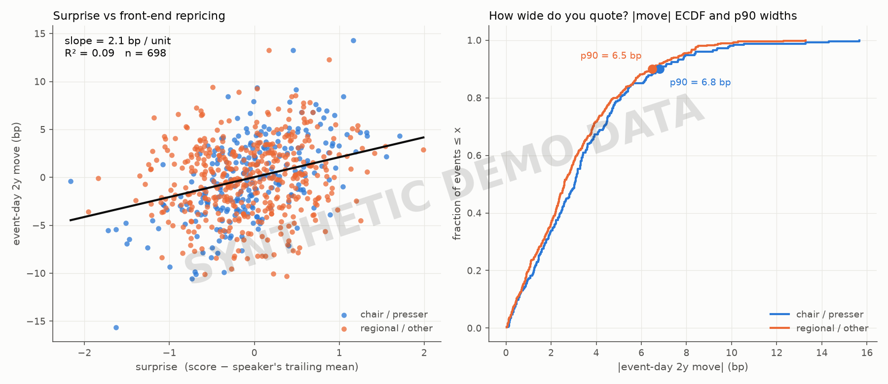

# Does central-bank talk move the front end?

**Question.** When a central banker surprises hawkish or dovish, does the front
end (2y) reprice — how fast, how much, and how much was already in the price?



*The chart above is from the synthetic demo (`--demo`) and is watermarked as
such; it exists so the pipeline is runnable and reviewable without the private
event archive. The real chart replaces it once the study runs on scored data.*

## The surprise definition (the part that needs the archive)

Every presser and speech in a timestamped archive covering eleven central banks
carries a hawkishness score. The **surprise is the deviation of a speaker's
score from that speaker's own trailing mean** (last 8 scored events, computed
strictly from prior events — no lookahead; see `tests/test_surprise.py`), not
from zero. A hawk sounding hawkish is not news; a hawk sounding *more* hawkish
than usual is. This speaker-relative baseline is the computation you cannot do
without the archive.

## Method

- **Market data (free):** daily 2y yields — US from FRED (`DGS2`), euro area
  from the ECB Data Portal (AAA 2y spot), both keyless, cached locally. The
  bank → market map in `cb_surprise/config.py` is extensible to the other banks.
- **Windows:** with free daily data the finest honest window is close-to-close.
  Event-day move = the close-to-close change containing the event (events after
  the local close roll to the next trading day). Pre-positioning = the move over
  the 5 prior days; post-drift = the next day.
- **Cuts:** OLS of the event-day move on the surprise (slope in bp per surprise
  unit, R²); the same regression on the pre-window (how much was already in the
  price); |move| distributions bucketed by surprise-magnitude tercile and by
  speaker — chair/president vs regional.
- **Reported object:** the full distribution of absolute moves, not just the
  mean. The distribution is what a trader can actually use.

## The honest result

Run on real data, the expected finding is a **null-ish one**: most
communication is already in the price by the time it is spoken, the event-day
R² is low, and pre-positioning explains a comparable or larger share. That is
the finding worth publishing — a low R² reported straight is more credible
than a suspiciously good fit, and it is what the data should show if markets
are doing their job. Numbers land in `output/findings.md` after each run.

## The market-maker's version

Given the empirical distribution of 2y moves around an event: if every fill
into the event is informed, the break-even half-width of a two-way quote is
E[|move|]; a desk that wants to survive the tail quotes nearer the p90.
`output/findings.md` reports both per event class — so "how much wider do you
quote a chair presser than a regional speech?" has a number, defensible from
the ECDF in the right panel of the chart.

## Run it

```bash
pip install -r requirements.txt

python run_study.py --demo                  # synthetic data, no network, no archive
python run_study.py --events data/events.csv  # scored archive (schema: data/README.md)

python -m pytest tests/                     # no-lookahead tests for the surprise
```

## Limitations

Daily data cannot separate the press-conference move from the rate-decision
move on the same day, or measure speed-of-repricing inside the day — that
needs intraday futures data. Decision-day events are therefore a joint
statement+presser read; the speech sample is the cleaner one. Scores are one
analyst's labels, so the surprise inherits their noise; the trailing-mean
baseline removes the speaker's level but not slow drift in the scoring scale.
